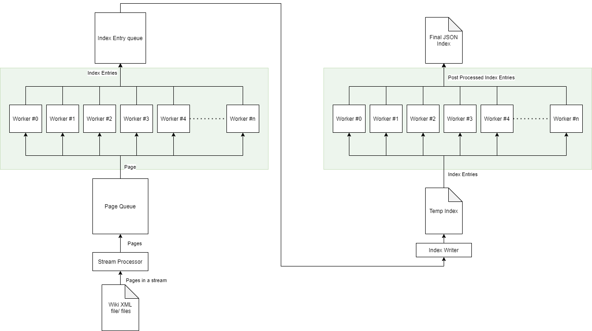
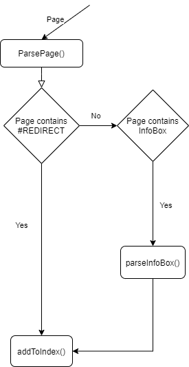

# Wiki Alternate Names
## Alternate names for Wiki pages
### Problem Description

Articles present on Wikipedia can by design have only one name. Sometimes though, people, cities, or even countries are, or have been known by alternate names. Often these names are in historical context (e.g. the city now called "Gdańsk" can be referred to as "Danzig" [Source](https://en.wikipedia.org/wiki/Wikipedia:Manual_of_Style/Lead_section#Alternative_names). People often know these things by their outdated names and by searching for them on the internet (Wikipedia) may not yield relevant satisfactory enough results. 

Other cases that may result in alternate names for the same article (as presented by [Wikipedia](https://en.wikipedia.org/wiki/Wikipedia:Manual_of_Style/Lead_section#Alternative_names) are:
  * **Non-English titles** (for english wiki) - used in articles where it is relevant, although not encouraged
  * **Alternate names** contained within the **first sentence of an article**
  * **Biographical** - multiple names for the same person. Based on different context, the person is addressed using a different name
### Motivation
Unifying these names we make it easier for anyone to access the same information regardless on the query term. 

Futhermore, by indexing main article titles with all its alternate titles we make the search performed by Wikipedia (and perhaps the whole of Wikipedia) faster due to reduced amount of requests required to reach articles we intend to reach (we skip the redirect requests). This may result in better experience for the users due to reduced load time of their articles.

### Final Solution

The final solution is only a slight modification of the proposed solution. The main difference is a post-processing step at the end which ensures the final index is mapped in a {title: [muiltiple subtitles]} way and makes the resulting index a JSON file. The final architercture is shown in Picture 3, and parts of the system are described below.

#### Stream Processor

The Stream Processor uses **zipped** wikipedia multistream files opened with python library **BZ2File**. This library allows them to be processed as any other stream and thus be an input to another library **lxml.etree**. This lib. is used to process the stream and build "mini-trees" made of just one page and deleted after processed. The Stream processor is used to extract **Title** and **Text** of the wiki page and enqueue them for later processing by workers.

#### Worker

The general flow of a worker is shown in an image below:

The workers get items (title and text) from the queue and use regex patterns to extract the alt. titles. The pattern to find a "#redirect" clause in a text is as follows: 

<code>(#REDIRECT|#redirect){1}\ ?\[{2}[A-Za-zá-žÁ-Ž[A-Za-zá-žÁ-Ž$&+,:;=?@#|'\"<>.^*()%!\]-]*\]{2}</code>

It matches the word "#redirect" followed by brackets containing the alt. title.

Infobox is found using the following pattern:
<code>\{{2} ?(Infobox){1}[\s\S]*\}{2}</code>

and data is later extracted using

<code>(Natívny názov|Rodné meno|Plné meno|Celý názov|Krátky miestny názov|Dlhý miestny názov).*</code>

or

<code>(official_name|nickname|name|native_name|pseudonym|conventional_long_name|conventional_short_name|fullname|altname).*</code>

depending on the language used.

After parsing the text the extracted alt. titles are input into a queue with the original titles.

#### Index Writer

The index wrtier gets data from queue. The **title** and **alt_title** are then written to a file in a "alt_title:title\n" pattern.

#### Index Post Processing

After all the ale pages are processed, the index gets post processed. The entries are read from the temporary index file, input into a **dict** and then dumped as a json into a json file. Parallelism is used here as well to speed up this process.